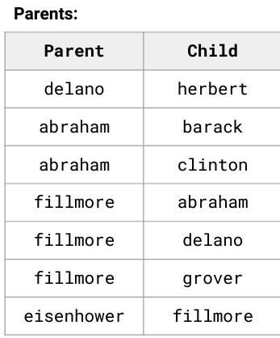

structure and interpretation of computer programs
fall 2024, nanjing university

pyton oop(object oriented prgramming)
BASIC:
1. 怎么定义class? 怎么初始化object?
定义class:
```python
class <name>:
    <suite>
```

example:
```python
class Clown:
    nose = 'big and red'
        def dance():
        return 'No thanks'
Clown.nose
Clown.dance()
```
初始化object:__init__
```python
class Account:
    def __init__(self, account_holder):
        self.balance = 0
        self.holder = account_holder
```
2. class attribute 和 instance attribute?
class attribute:
类属性是属于类本身的属性,所有实例共享同一个类属性。类属性通常在类定义中直接声明。
```python
class MyClass:
    def __init__(self, value):
        self.instance_attr = value
obj = MyClass(20)
print(obj.instance_attr)  # 输出: 20
```

instance attribute:
实例属性是属于特定实例的属性,每个实例都有自己的实例属性。实例属性通常在 __init__ Methods中定义。
```python
class MyClass:
    def __init__(self, value):
        self.instance_attr = value
obj = MyClass(20)
print(obj.instance_attr)  # 输出: 20
```
3. Attribute lookup的四条规则?
多态、继承、抽象、封装

(1)多态(Polymorphism)
多态是指同一个Methods或操作可以在不同的类中具有不同的行为。
```python
class Dog:
    def speak(self):
        return "Woof!"

class Cat:
    def speak(self):
        return "Meow!"

def animal_sound(animal):
    return animal.speak()

dog = Dog()
cat = Cat()

print(animal_sound(dog))  # 输出: Woof!
print(animal_sound(cat))  # 输出: Meow!
```
animal_sound Functions可以接受任何实现了 speak Methods的对象,这就是多态的体现。

(2)继承(Inheritance)
继承是指一个类可以继承另一个类的属性和Methods,从而实现代码复用。Python支持单继承和多继承。
```python
class Animal:
    def __init__(self, name):
        self.name = name

    def speak(self):
        return "Sound"

class Dog(Animal):  # 继承自 Animal
    def speak(self):
        return "Woof!"

dog = Dog("Buddy")
print(dog.name)      # 输出: Buddy (继承自 Animal)
print(dog.speak())   # 输出: Woof! (重写了父类的Methods)
```
Dog 类继承了 Animal 类的 __init__ Methods和 name 属性。
Dog 类重写了 speak Methods,实现了自己的行为。

(3)抽象(Abstraction)
抽象是指隐藏复杂的实现细节,只暴露必要的接口。(黑盒子)
```python
from abc import ABC, abstractmethod

class Animal(ABC):  # 抽象基类
    @abstractmethod
    def speak(self):
        pass

class Dog(Animal):
    def speak(self):
        return "Woof!"

# animal = Animal()  # 报错,不能实例化抽象类
dog = Dog()
print(dog.speak())  # 输出: Woof!
```
Animal 是一个抽象基类,不能直接实例化。
子类必须实现 speak Methods,否则会报错。

(4)封装(Encapsulation)
封装是指将数据（属性）和行为（Methods）包装在类中,并控制对它们的访问。
```python
class BankAccount:
    def __init__(self, balance):
        self.__balance = balance  # 私有属性

    def deposit(self, amount):
        self.__balance += amount

    def withdraw(self, amount):
        if amount <= self.__balance:
            self.__balance -= amount
        else:
            print("Insufficient funds")

    def get_balance(self):
        return self.__balance

account = BankAccount(1000)
account.deposit(500)
account.withdraw(200)
print(account.get_balance())  # 输出: 1300

# 无法直接访问私有属性
# print(account.__balance)  # 报错
```
__balance 是私有属性,只能在类内部访问。
通过 deposit、withdraw 和 get_balance Methods控制对 __balance 的访问。

4. Methods和functions差别和用法?
(1)Functions:
Functions是独立的代码块,可以通过Functions名直接调用。Functions可以接受参数并返回值。
```python
def my_function(x):
    return x * 2
print(my_function(5))  # 输出: 10
```

(2)Methods:
Methods是定义在类中的Functions,通常通过类的实例来调用。
Methods的第一个参数通常是 self,表示调用该Methods的实例。
```python
class MyClass:
    def my_method(self, x):
        return x * 2

obj = MyClass()
print(obj.my_method(5))  # 输出: 10
```

比较
```python
# function
def add(a, b):
    return a + b
# method
class Calculator:
    def add(self, a, b):
        return a + b

result = add(3, 5)  # 输出: 8
calc = Calculator()
result = calc.add(3, 5)  # 输出: 8
```

INHERITANCE(继承):
1. attribute assigment(属性赋值)?
在继承中，子类可以继承父类的属性和方法。属性赋值可以通过以下方式实现：
在父类的 __init__ 方法中定义属性。
在子类的 __init__ 方法中调用父类的 __init__ 方法(使用 super())
```python
class Parent:
    def __init__(self, name):
        self.name = name  # 父类属性

class Child(Parent):
    def __init__(self, name, age):
        super().__init__(name)  # 调用父类的 __init__ 方法
        self.age = age  # 子类属性

child = Child("Alice", 10)
print(child.name)  # 输出: Alice (继承自父类)
print(child.age)   # 输出: 10 (子类属性)
```

2. 什么情况下用inheritance
代码复用： 当多个类有共同的属性和方法时，可以将这些共同部分提取到父类中，子类继承父类以避免重复代码。
逻辑关系： 当类之间存在“是一个（is-a）”关系时，例如 Dog 是一种 Animal。
扩展功能： 子类可以在继承父类的基础上，添加新的属性和方法，或者重写父类的方法。
```python
class Animal:
    def speak(self):
        return "Sound"

class Dog(Animal):  # Dog 是一种 Animal
    def speak(self):
        return "Woof!"  # 重写父类方法
```

3. inheritance下的attribute lookup?
实例属性： 首先在实例的命名空间中查找属性。
子类属性： 如果在实例中找不到，则在子类的命名空间中查找。
父类属性： 如果在子类中找不到，则在父类的命名空间中查找。
继承链： 如果在父类中找不到，则继续在父类的父类中查找，直到找到或抛出 AttributeError。
```python
class Grandparent:
    attr = "Grandparent"
class Parent(Grandparent):
    attr = "Parent"
class Child(Parent):
    pass
child = Child()
print(child.attr)  # 输出: Parent (子类中没有 attr，查找父类)
```
4. inheritance和composition?
inheritance（继承）：
表示“是一个（is-a）”关系。
子类继承父类的属性和方法。
适用于逻辑上紧密相关的类。

Composition（组合）：
表示“有一个（has-a）”关系。
一个类包含另一个类的实例作为属性。
适用于逻辑上松散相关的类。
```python
# inheritance
class Animal:
    def speak(self):
        return "Sound"
class Dog(Animal):  # Dog 是一种 Animal
    pass
# composition
class Engine:
    def start(self):
        return "Engine started"
class Car:
    def __init__(self):
        self.engine = Engine()  # Car 有一个 Engine

    def start(self):
        return self.engine.start()
car = Car()
print(car.start())  # 输出: Engine started
```
如果类之间的关系是“是一个”，使用继承。
如果类之间的关系是“有一个”，使用组合。

SPECIAL METHODS(简直就是魔法)
1. repr和str?
__repr__:
调用方式：repr(obj) 或直接打印对象(如果没有定义 __str__)
__str__:
调用方式：str(obj) 或 print(obj)

```python
2e3#2000.0
repr(2e3)#'2000.0'
eval(repr(2e3))#2000.0

min#<built-in function min>
repr(min)#'<built-in function min>'

from fractions import Fraction
half = Fraction(1,2)
repr(half)#'Fraction(1,2)'
str(half)#'1/2'
print(half)#1/2

class Person:
    def __init__(self, name, age):
        self.name = name
        self.age = age

    def __repr__(self):
        return f"Person(name='{self.name}', age={self.age})"

    def __str__(self):
        return f"{self.name}, {self.age} years old"

person = Person("Alice", 25)
print(repr(person))  # 输出: Person(name='Alice', age=25)
print(str(person))   # 输出: Alice, 25 years old
print(person)        # 输出: Alice, 25 years old (默认调用 __str__)
```

2. operator pverloading?
通过实现特殊方法来定义类对象之间的运算符行为。
+	    __add__	    加法
-	    __sub__	    减法
*	    __mul__	    乘法
/	    __truediv__	除法
==	    __eq__	    等于
<	    __lt__	    小于
>	    __gt__	    大于
[]	    __getitem__	索引访问
len()	__len__	    返回对象长度

```python
class Point:
    def __init__(self, x, y):
        self.x = x
        self.y = y

    def __add__(self, other):
        return Point(self.x + other.x, self.y + other.y)

    def __eq__(self, other):
        return self.x == other.x and self.y == other.y

    def __repr__(self):
        return f"Point({self.x}, {self.y})"

p1 = Point(1, 2)
p2 = Point(3, 4)
p3 = p1 + p2  # 调用 __add__
print(p3)     # 输出: Point(4, 6)
print(p1 == p2)  # 输出: False (调用 __eq__)
```
3. polymorphic functions?(多态函数)
多态函数是指能够处理多种类型对象的函数
```python
class Dog:
    def speak(self):
        return "Woof!"

class Cat:
    def speak(self):
        return "Meow!"

def animal_sound(animal):
    return animal.speak()

dog = Dog()
cat = Cat()

print(animal_sound(dog))  # 输出: Woof!
print(animal_sound(cat))  # 输出: Meow!
```

LINKED LIST & TREES

linked list defination:
first is the value
rest contains a pointer to a linked list

```python
class Link:
    empty = ()
    def __init__(self, first, rest = empty):
        assert rest is Link.empty or isinstance(rest, Link)
        self.first = first
        self.rest = rest

lnk = Link(5, Link(6, Link(7)))
lnk.rest.rest.first#7
lnk.rest.rest.rest is Link.empty#True

def map(lnk, f):
    while lnk is not Link.empty:
        lnk.first = f(lnk.first)
        lnk = lnk.rest


class Tree:
    def __init__(self, label, branches = []):
        self.label = label
        for branch in branches:
            assert isinstance(branch, Tree)
        self.branches = list(branches)
    
    def tree(label, branches = []):
        for branch in branches:
            assert is_tree(branch)
        return [label] + list(branches)
    
    def label(tree):
        return tree[0]
    
    def branches(tree):
        return tree[1:]
```
1. corner cases?（终止条件）
链表的边界情况：
空链表： 链表为空时，头节点为 None。
单节点链表： 链表中只有一个节点。
头节点或尾节点的操作： 插入或删除头节点或尾节点时需要特殊处理。

树的边界情况：
空树： 树为空时，根节点为 None。
单节点树： 树中只有一个节点。
左子树或右子树为空： 在二叉树中，左子树或右子树可能为空。

2. 迭代与递归?
迭代：
使用循环（如 while 或 for）遍历数据结构。
通常更节省内存，因为不需要额外的函数调用栈。
适合处理深度较大的数据结构。

递归：
通过函数调用自身来遍历数据结构。
代码更简洁，但可能引发栈溢出问题（对于深度较大的数据结构）。
适合处理分治问题（如树的遍历）。

3. 嵌套linked list?
嵌套链表是指链表的节点本身也是一个链表。这种结构可以用于表示复杂的数据，如多维链表或图的邻接表。

scheme
BASIC:
1. 有什么数据类型？scheme expressions
(1)Atomic expressions(最小)：
Self-evaluating: 
数字（Numbers）：包括整数、浮点数等。
布尔值（Booleans）：#t 表示真，#f 表示假。
Symbols: names bound to values
符号（Symbols）：例如 'a，'hello。
字符串（Strings）：例如 "hello"。
(2)combinations
列表（Lists）：例如 (1 2 3)，(a b c)。
程序（Procedures）：即函数。

2.怎么定义函数？
(define (<name> <praram1> <param2>) <body>)
```scheme
(define x (+3 4));x
x;7
(define (square x)
    (* x x))
```

3. 求值规则？
Scheme的求值规则遵循以下步骤：
原子表达式：数字、字符串、布尔值等直接求值为它们自身。
符号：符号求值为它们绑定的值。
列表：列表的第一个元素被视为操作符，其余元素被视为操作数。Scheme会先对操作符和操作数进行求值，然后应用操作符到操作数上。
特殊形式：如 define、if、lambda 等，有特殊的求值规则。
例如，(+ 1 2) 的求值过程是：
先对 + 求值，得到一个加法过程。
对 1 和 2 求值，得到数字 1 和 2。
应用加法过程到 1 和 2，得到结果 3。

4. tail recusion?
例如，计算阶乘的尾递归版本：
```scheme
(define (factorial n)
  (define (iter product counter)
    (if (> counter n)
        product
        (iter (* product counter) (+ counter 1))))
  (iter 1 1))
```

LAMBDA:匿名函数
(lambda (<param1> <param2> …) <body>)
```scheme
(lambda (x) (* x x));(lambda (x) (* x x))
(lambda (x) (* x x) 5);25
(define square (lambda (x) (* x x)));square
(square 4);16

(define (apply-twice f x) (f (f x)))
(apply-twice (lambda (x) (* x 2)) 3)  ; 12

(define (make-adder n)
  (lambda (x) (+ x n)))
(define add5 (make-adder 5))
(add5 10)  ; 15
```

MORE:
pairs:
```scheme
(define x(cons 1(cons 3 nil)));x
x;(1 3)
(car x);1
(cdr x);(3)
```
lists:
```scheme
(cons 1 (cons 2 nil));(1 2)
(define x (cons 1 (cons 2 nil)));x
x;(1 2)
(car x);1
(cdr x);(2)
(cons 1 (cons 2 (cons 3 (cons 4 nil))));(1 2 3 4)

(define a 1);a
(define b 2);b
(list a b);(1 2)
(list 'a b);(a 2)
'(a b c);(a b c)
(car '(a b c));a
(cdr '(a b c));(b c)
```

representing expressions:
```scheme
'(+ 1 2);(+ 1 2)
(eval '(+ 1 2));3
(list 'quotient 10 2);(quotient 10 2)
(eval (list 'quotient 10 2));5

;begin:after evaluate, the final expression
(begin 3 2 1);1
(begin (define x 2) (define x (+ x 1)) x);3

;let:bound to the value of expression in parallel
(let ((x 10) (y 20)) (+ x y));30

(define (print-and-add x y)
  (begin
    (display "Adding ")
    (display x)
    (display " and ")
    (display y)
    (newline)
    (+ x y)))

(let ((x 10)
      (y 20))
  (begin
    (display "x = ")
    (display x)
    (newline)
    (display "y = ")
    (display y)
    (newline)
    (+ x y)))  ; 30
```

特性	    let	                                       begin
用途	    创建局部变量绑定	                         顺序执行多个表达式
语法	    (let ((var1 val1) (var2 val2) …) body)	   (begin expr1 expr2 …)
返回值	    body 中最后一个表达式的值	                 最后一个表达式的值
常见场景	局部计算、临时变量	                         副作用操作（如输入输出）、多步计算


MACROS:
1. define 和 define-macro?
define 用于定义变量或函数。
define-macro 用于定义宏。宏在展开时会生成代码，而不是直接求值。
```scheme
(define x 10)
(define (square x) (* x x))
(define-macro (my-if condition then else) 
    `(if ,condition ,then ,else))
(my-if (> 3 2) 'true 'false); #t
```

2. quote, unquote, quqsiquote?
(1)quote
quote 用于阻止表达式被求值，直接返回表达式本身。
语法：(quote expr) 或简写为 'expr。
(2)unquote
unquote 用于在 quasiquote 中插入一个需要求值的表达式。
语法：,expr
(3)quasiquote
quasiquote 类似于 quote，但允许部分表达式被求值。
语法：`expr
```scheme
(quote (1 2 3))  ; 返回 (1 2 3)
'(1 2 3)         ; 同上
(define x 10)
`(1 2 ,x)  ; 返回 (1 2 10)
(define x 10)
`(1 2 ,x 3)  ; 返回 (1 2 10 3)
```
3. 求值规则
宏的求值规则与函数不同，分为两个阶段：
展开阶段：在编译时（或解释时），宏被展开为新的代码。
求值阶段：展开后的代码在运行时被求值。
```scheme
(define-macro (my-or a b)
  `(if ,a ,a ,b))
(my-or (> 3 2) (> 4 5))  ; 展开为 (if (> 3 2) (> 3 2) (> 4 5))，求值为 #t
```

特性	    宏（Macro）	              函数（Function）
求值时机	编译时（或解释时）展开	    运行时求值
参数处理	接收未求值的表达式	        接收已求值的值
返回值	    返回新的代码	           返回计算结果
用途	    扩展语言功能，实现语法糖	封装逻辑，进行计算


STREAM
1. stream和list的区别？

特性	    Stream（流）	                       List（列表）
计算时机	延迟计算（按需计算）	                立即计算（所有元素一次性计算）
内存占用	只计算和存储当前需要的部分，节省内存	  所有元素都存储在内存中，占用更多内存
适用场景	无限序列、大规模数据	                有限序列、小规模数据
实现方式	使用 cons 和 delay 实现延迟计算	        使用 cons 直接构造

2. 能对stream进行哪些操作
(1)创建 Stream：
使用 cons 和 delay 创建流。
(2)访问 Stream 元素：
使用 car 获取当前元素。
使用 cdr 获取流的剩余部分（需要 force 来强制计算）。
(3)遍历 Stream：
使用递归或高阶函数（如 map、filter）遍历流。
```scheme
(define lst (list 1 2 3 4 5))  ;lst 所有元素立即计算并存储
lst;(1 2 3 4 5)

(define (stream-range n)
  (cons n (delay (stream-range (+ n 1)))))
(define s (stream-range 1))  ; 只计算当前需要的部分
s;(1 . #[promise (not forced)])
(car s);1
(cdr s);#[promise (not forced)]
(force (cdr s));(2 . #[promise (not forced)])

(define (stream-take n s)
  (if (= n 0)
      '()
      (cons (car s) (stream-take (- n 1) (force (cdr s))))))
(stream-take 5 (stream-range 1))  ; (1 2 3 4 5)

(define (stream-map f s)
  (cons (f (car s)) (delay (stream-map f (force (cdr s))))))
(define s (stream-map (lambda (x) (* x x)) (stream-range 1)))
(stream-take 5 s)  ; (1 4 9 16 25)
```

3. 递归的strem?
```scheme
(define (stream-range n)
  (cons n (delay (stream-range (+ n 1)))))
(define s (stream-range 1))  ; 1, 2, 3, 4, …

(define (fib-stream a b)
  (cons a (delay (fib-stream b (+ a b)))))
(define fibs (fib-stream 0 1))  ; 0, 1, 1, 2, 3, 5, …
(stream-take 10 fibs)  ; (0 1 1 2 3 5 8 13 21 34)

(define (sieve s)
  (cons (car s)
        (delay (sieve (stream-filter
                       (lambda (x) (not (= 0 (modulo x (car s)))))
                       (force (cdr s)))))))
(define primes (sieve (stream-range 2)))  ; 2, 3, 5, 7, 11, …
(stream-take 10 primes)  ; (2 3 5 7 11 13 17 19 23 29)
```

INTERPRETER
1. REPL?(Read-Eval-Print Loop)
读取-求值-打印
Read：读取用户输入的表达式。
Eval：对表达式进行求值。
Print：打印求值结果。
Loop：循环这个过程。
```scheme
(define expr '(+ 2 3));expr
(eval expr);5
(car expr);+
(cdr expr);(2 3)
```
2. scheme程序在python里用什么表示?Pair
```python
class Pair:
    def __init__(self, first, second):
        self.first = first
        self.second = second
    def __repr__(self):
        return f'Pair({self.first}, {self.second})'

#scheme (+ 2 3)
Pair('+', Pair(2, Pair(3, nil)))
```
特殊形式：quote
quote 是 Scheme 中的特殊形式，用于直接返回表达式本身而不求值。
例如：
(quote hello) 返回 hello。
'(1 2 3) 返回 (1 2 3)。
在解释器中，quote 表达式被转换为 Pair('quote', Pair(expr, nil))。

1. scheme的值在python里用什么表示?对应
数字：直接用 Python 的数字类型。例如：
Scheme 的 42 表示为 Python 的 42。
布尔值：用 Python 的布尔类型。例如：
Scheme 的 #t 表示为 Python 的 True。
Scheme 的 #f 表示为 Python 的 False。
字符串：用 Python 的字符串类型。例如：
Scheme 的 "hello" 表示为 Python 的 "hello"。
符号：用 Python 的字符串表示。例如：
Scheme 的 'cons 表示为 Python 的 'cons'。
列表：用 Python 的列表或自定义的 Pair 类表示。例如：
Scheme 的 (1 2 3) 可以表示为 Pair(1, Pair(2, Pair(3, nil)))。

4. eval和apply?
evaluator:
Eval：
用于对表达式进行求值。
根据表达式的类型，调用不同的求值规则。
Apply：
用于将过程（函数）应用于参数。
根据过程的类型（内置过程或用户定义过程），执行相应的操作。

```python
class Pair:
    def __init__(self, first, second):
        self.first = first
        self.second = second
    def __repr__(self):
        return f'Pair({self.first}, {self.second})'

eval(Pair('+', 
     Pair(2,
     Pair(Pair('*', Pair(4, Pair(1, nil))),
     Pair(5, nil)))))

#在这段代码(+ 2 (* 4 1) 5)中：
eval(Pair(‘+’, Pair(2, Pair(Pair(‘*’, Pair(4, Pair(1, nil))), Pair(5, nil)))))
    eval('+')
    eval(2)
    eval Pair(Pair('*', Pair(4, Pair(1, nil))))
        eval('*')
        eval(4)
        eval(1)
        apply(BuiltinProc(scheme_mul), [4, 1])
    eval(5)
    apply(BuiltinProc(scheme_add), [2, 4, 5])

#在这段代码
# (define (f x) (+ x 1)) 
# (* (f 3) 2)
eval(Pair('*', Pair(Pair('f', Pair(3, nil)) Pair(2, nil))))
    eval('*')
    eval('f', Pair(3, nil))
        eval('f')
        eval(3)
        apply(lambda, 3)
            eval(Pair('+', Pair('x', Pair(1, nil))))
                eval('+')
                eval('x')
                eval(1)
                apply(BuiltinProc(scheme_add), [3, 1])
    eval(2)
    apply(BuiltinProc(scheme_mul), [4, 2])
```
calls:
eval:10
apply:3

SQL
1. 怎么创建table? 更新table?
```SQL
CREATE TABLE cities AS
    SELECT 38 AS latitude, 122 AS longtitude, "Berkelry" AS name UNION
    SELECT 42,             71,                "Cambridge"        UNION
    SELECT 45,             93,                "Minneapolis";

SELECT "west coast" AS region, name FROM cities WHERE longitude >= 115 UNION 
SELECT "other",                name FROM cities WHERE longitude < 115;
```


```SQL
CREATE TABLE parents AS
    SELECT "delano" AS parent, "herbert" AS child UNION
    SELECT "abraham",          "barack"           UNION 
    SELECT "abraham",          "clinton"          UNION 
    SELECT "fillmore",         "abraham"          UNION
    SELECT "fillmore",         "delano"           UNION 
    SELECT "fillmore",         "grover"           UNION 
    SELECT "eisenhower",       "fillmore";   
```


2. 单表查询
使用 SELECT 语句可以从表中检索数据。你可以选择特定的列，或者使用 * 选择所有列
使用 WHERE 子句可以过滤出符合条件的行。
使用 ORDER BY 可以对结果进行排序，LIMIT 可以限制返回的行数。
```SQL
SELECT column1, column2 FROM table_name;
SELECT name, age FROM dogs;

SELECT column1, column2 FROM table_name WHERE condition;
SELECT name FROM dogs WHERE age > 5;

SELECT column1, column2 FROM table_name ORDER BY column1 ASC/DESC LIMIT number;
SELECT name FROM dogs ORDER BY age DESC LIMIT 10;
```
ASC:升序
DESC:降序
3. join?
SELECT * FROM table1, table2;
```SQL
SELECT name FROM artists
    WHERE first_year_active > 2015 LIMIT 10;

SELECT s.name, s.artist
    FROM songs AS s, artists AS ar, albums AS al
        AND release_year = 2010
        ORDER BY first_year_active;
```
4. aggregation聚合
SQL 提供了多种聚合函数，如 COUNT、SUM、AVG、MIN 和 MAX，用于对一组数据进行计算
使用 GROUP BY 可以对数据进行分组，然后对每个组进行聚合计算。
使用 HAVING 子句可以对分组后的结果进行过滤。
```SQL
SELECT COUNT(*) FROM table_name;
SELECT AVG(column) FROM table_name;
SELECT AVG(age) AS avg_age FROM dogs;

SELECT column, COUNT(*) FROM table_name GROUP BY column;
SELECT fur, AVG(age) AS avg_age FROM dogs GROUP BY fur;

SELECT column, COUNT(*) FROM table_name GROUP BY column HAVING condition;
SELECT fur, AVG(age) AS avg_age FROM dogs GROUP BY fur HAVING COUNT(*) > 1;
```

5. 表的创建与删除
使用 CREATE TABLE 语句创建表，可以指定列名和数据类型，还可以为列设置默认值
使用 DROP TABLE 语句删除表。
使用 INSERT INTO 语句插入新行。
使用 UPDATE 语句更新现有行。
使用 DELETE 语句删除行。
```SQL
CREATE TABLE [name]([columns]);
CREATE TABLE parents(parent, child);
CREATE TABLE dogs(name, fur, phrase DEFAULT 'woof');

DROP TABLE [IF EXISTS] [name]; 
DROP TABLE dogs; 
DROP TABLE IF EXISTS parents;

INSERT INTO table_name (column1, column2) VALUES (value1, value2);
INSERT INTO dogs (name, fur) VALUES ('fillmore', 'curly');

UPDATE table_name SET column = value WHERE condition;
UPDATE dogs SET phrase = 'WOOF' WHERE fur = 'curly';

DELETE FROM table_name WHERE condition;
DELETE FROM dogs WHERE fur = 'curly' AND phrase = 'WOOF';
```